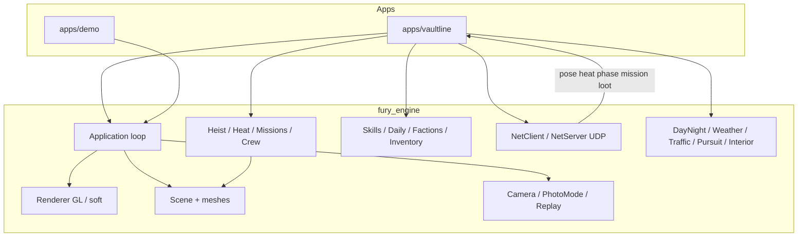

# Fury

**Fury** is a lightweight, original C++17 game engine with SDL2 window/input and a
lit 3D mesh renderer (OpenGL 3.3 core preferred, CPU software rasterizer fallback).

> **Vaultline 3.4.0** — map UI + loft fast travel; still **not** AAA / GTA graphics.

> Not Unreal. Not Unity. Not a GTA clone. Just Fury.

## Direction: Vaultline

**Vaultline** is the first playable vertical slice on Fury — an *original*
**bank-heist open-world MMO** prototype set in fictional **Harbor Metro**,
featuring **Meridian Mutual** bank, the **Crown & Cutler** jewelry front,
**Ashcourt Market** (ATM heist-lite), and the **Harbor Armored Depot**.

> **Honest scope (v3.4.0):** this is a **playable prototype / vertical slice**, not AAA
> and not GTA parity. Expect colored-box districts (now denser with parked cars / neon / rooftop AC),
> **LOD / occlusion-lite** (detail props + behind-plane AABB cull + deep-indoor sector hide),
> **low-poly humanoid** NPC/crew meshes with procedural limb swing, optional **V** third-person body,
> stub AI + **civilian traffic**, localhost net (host/join + **lobby** + mission/loot sync), quality presets (`FURY_QUALITY` / **F6**), chat/ready stubs,
> faction reputation stubs, intro cutscene, materials/reflect/bloom polish, **skill tree** (**N**) + **daily contracts**, **interior light zones** + door Enter/snap, optional procedural audio +
> **F9** photo / **F10** replay, **F8** mute, Harbor jobs + **North Quay** container yard + **Meridian Night Vault** finale, HUD/help polish, and a Meridian heist you can finish in about **2–5 minutes**.
> No Rockstar / GTA IP. See [CHANGELOG.md](CHANGELOG.md).

This is a direction and a growing slice, not a finished MMO:

| Now (this repo) | Next |
|-----------------|------|
| Harbor Metro + **Ridge Pier** + **Ashcourt Market** + **Armored Depot** + **Harbor loft** + **North Quay**; enterable jewelry + ATM alcove + depot cage + loft + sealed container | Multi-floor interiors / streaming districts |
| Day/night cycle (sun/sky/lamp emissive lerp) + **weather stub** (rain / auto-drizzle) + **interior lighting zones** (bank/jewelry/loft/depot) + **door Enter** tips / optional snap | Storm VFX, multi-floor interiors |
| Wandering civilian **humanoid** NPCs (**display names** + look-near **nameplate**) + bank guard + **Ashcourt fence** NPC + **patrol cars** on high heat/alarm + **civilian traffic**; **Q** bark dialogue; procedural limb swing | Awareness cones, denser routes |
| Driveable **getaway van** (cab+bed, night headlights) + **stealable Ashcourt sedan** (`F`/`E`); in-van **C** radio stub; **accel/decel** + Shift boost; lose pursuits by distance/van/loft | Full vehicle physics |
| **Crew stubs** (Rook / Sparrow humanoids) follow during heist; loot speed boost; **banter** on phase changes | Full crew AI / role abilities |
| Net stub **crew session roles** + **host/join** + **chat** + **ready** + **lobby** + mission/loot sync | Interest management / richer matchmaking |
| Wanted **heat** meter (rises near guards / patrol contact); **siren** flash when heat high while looting; loft clears heat | Stealth scoring, wanted tiers |
| **District map** (**Tab**) + **mission board** (**M**) + **quest journal** (**J**) — Harbor jobs + North Quay + Night Vault; loft fast travel; co-op lobby (**L**) | Contract scripting / richer lobbies |
| **Ashcourt fence shop** (**B**) — buy perks + **sell** named loot chips (**S**) | Full economy / black-market tree |
| **Loot tables** — per-mission cash + BearerBond / Sapphire / LedgerDrive | Procedural drop graphs |
| **Inventory** (**I**) — HUD panel for cash + chip counts | Persistent profiles, cloud sync |
| **Factions / rep** (**U**) — Pierline Crew, Metro Watch, Ashcourt Syndicate (−100..100) | Full faction story arcs |
| **Photo mode** (**F9**) — freeze sim, free cam, hide HUD | Orbit / filters / poses |
| **Replay stub** (**F10**) — ~8 s ring buffer scrub + ghost path | Full take recorder |
| **Skill tree** (**N**) — XP from heists; Silent Entry / Fast Hands / Cool Under Heat (1 rank) | Deeper trees / synergies |
| **Daily contracts** — one rotating date-hash bonus objective + cash; HUD pip | Weekly / co-op contracts |
| **3 save slots** (`[`/`]`) — `vaultline_session_slot{N}.json` autosave | Cloud sync / profile UI |
| Heist: approach → breach → loot → escape → success/fail + audio cue hooks | Full mission scripting / multiplayer heists |
| Audio (`null` / optional SDL_mixer procedural beeps) — footstep / breach / success / siren + **F8** mute | Sample banks, spatial SFX |
| Inventory cash / loot bags / **named chips**, HUD bars (cash/loot/score/**heat**/shop/inv/slots) | Persistent profiles, cloud sync |
| AABB building collision (walk mode); vehicle collision radius | Character controller, cover |
| `NetClient` / `NetServer` **localhost UDP loopback** (pose + heat + phase + **optional cash** → Ghost) | Cross-machine sockets, authority, interest mgmt |
| AO-lite + Reinhard/gamma tonemap, water **wave normals** + shore **foam** + fresnel, emissive lamps + **point lights** (nearest 2–3); **directional shadows** (GL; **2-cascade stub** on high, single med/low; off on llvmpipe); **bloom-lite**; **LOD stub** + **occlusion-lite** + material draw-sort | Full CSM / GPU instancing |
| **District map** (**Tab**) + minimap stub — colored districts, blips, loft **fast travel** | Radar icons / streaming |
| **Onboarding** — first-run tips + compass breadcrumb (board → target → escape) | Scripted tutorial missions |
| **Cutscene stub** — Harbor Metro fly-over after splash (~4s, **Esc** skip) | Full cinematics |
| **Finale** — **Meridian Night Vault** (unlock after other jobs / `FURY_UNLOCK_ALL=1`) | Multi-act campaign |
| **Presentation** — 1.5s VAULTLINE splash; success/fail + ending banners; **H** controls help; **P** FPS toggle | Full UI / menus |

No Rockstar / GTA names, maps, characters, brands, or missions.

### Vaultline controls

| Key | Action |
|-----|--------|
| **WASD** | Move with accel/decel (drive while in vehicle) |
| **Mouse** | Look (click to capture; smoothed) |
| **Space / Ctrl** | Up / down in fly mode |
| **Shift** | Sprint / vehicle boost |
| **R** | Cycle weather (clear → rain → auto-drizzle) |
| **F** | Toggle fly/walk; enter/exit getaway van or steal Ashcourt sedan when near |
| **V** | Toggle first / third person (player body when walk + third) |
| **C** | Cycle radio stations while in a vehicle (3 stations; HUD pip + beep) |
| **E** | Breach vault/safe/ATM; reset after success/fail; enter/exit vehicle (walk into Harbor loft to cool heat) |
| **Q** | Talk — 1–3 line bark dialogue with nearby named NPC (look near; unique fence/guard/crew lines) |
| **Tab** | District map (fullscreen-ish; **1–6** / click focus; loft **Enter** fast travel) |
| **M** | Mission board (job list + payout tiers) |
| **J** | Quest journal (missions + completion flags) |
| **B** | Ashcourt fence buy/sell menu (must be near shop to trade) |
| **I** | Inventory panel (cash + BearerBond / Sapphire / LedgerDrive counts) |
| **U** | Faction reputation panel (Pierline / Metro Watch / Syndicate) |
| **N** | Skill tree panel (XP; unlock Silent Entry / Fast Hands / Cool Under Heat with **1/2/3**) |
| **1 / 2 / 3 / 4 / 5 / 6** | Select Meridian / Crown / Ashcourt ATM / Harbor Depot / **Night Vault** / **North Quay Yard**, or buy perks (**1–3**) if **B** open |
| **Left / Right** | When **B** open: select loot chip type to sell |
| **S** | When **B** open near shop: sell one of the selected loot chip |
| **T** | Cycle heist target when idle |
| **[ / ]** | Previous / next save slot (`vaultline_session_slot{N}.json`) |
| **P** | Toggle FPS overlay + FPS log |
| **F6** | Cycle graphics quality (low → med → high); or `FURY_QUALITY=` |
| **F8** | Toggle audio mute (ambience hooks still update) |
| **F9** | Photo mode — freeze sim, free cam, hide HUD (Esc exits) |
| **F10** | Replay scrub — last ~8 s path; A/D scrub; ghost trail (Esc exits) |
| **H** | Toggle full controls help overlay (Esc / H closes) |
| **Enter / Y** | Open chat line; Enter sends, Esc cancels |
| **K** | Toggle local ready pip (synced over net; crew mirrors) |
| **L** | Pre-heist lobby (remotes + mission); auto-opens when all ready; host **Enter** starts |
| **Esc** | Skip intro cutscene; release mouse; Esc again quits (cancels chat if open) |

**Heist flow:** open the board (**M**) → pick a job → walk into Meridian Mutual (or
enterable Crown & Cutler / Ashcourt ATM alcove / Harbor Armored Depot) → **E** to breach → loot timer →
follow the compass/minimap to the **green extraction pad** (or drive the getaway van).
Heat rises near the bank guard during breach/loot; max heat fails the job.
High heat / alarm spawns **patrol cars** (box meshes) that pursue you — bumper contact
raises heat; lose them by distance, the getaway van, or ducking into the **Harbor loft**
safehouse (heat clears while inside; save-slot tip shows). High heat while looting flashes
**siren** beacons. Rook/Sparrow drop short **banter** lines on phase changes.
**R** cycles weather: rain densifies fog, draws downward particle streaks, and wets asphalt.
Footstep / breach / success / **siren** cues fire via optional mixer beeps (silent backend logs once; **F8** mutes).
Spend cash at the **Ashcourt fence** (**B**) on crew / heat damp / loot speed; sell
extra **BearerBond / Sapphire / LedgerDrive** chips with **S** (Left/Right to select).
Successful extracts roll a **per-mission loot table** (weighted cash + chips), raise
**Pierline** standing, and lower **Metro Watch**. Fence sells nudge **Ashcourt Syndicate**
tension. Low Metro Watch speeds pursuit spawns; high Pierline discounts shop perks.
Progress autosaves to the active slot (and on quit), including item counts, faction reps, **XP/skills**, and **daily claim** day.
Successful extracts grant **XP**; spend it on the skill tree (**N**). A **daily contract** (hash of date) adds a bonus objective — meet it for cash (HUD pip).

**HUD:** cash, loot, score, heat, crew, mission tier/board, quest journal, buy/sell menu,
inventory (**I**), reputation (**U**), skills (**N**), daily pip, save-slot pips, ready pips, **pursuit pips**, chat log bars, minimap,
onboarding tip bar, crew banter tip, **NPC nameplate** / **Q dialogue** panel, alarm pip, safehouse save tip, objective compass,
success/fail banner, **H** help overlay, optional FPS.

### Districts

Stub districts on **one continuous ground plane** — no streaming / no open-world streaming yet.

| District | Approx. | Contents |
|----------|---------|----------|
| **Harbor Metro** | plaza @ origin | Meridian Mutual bank, Crown & Cutler jewelry, extraction pad (~34,30), street props |
| **Ridge Pier** | east bridge ~x=70 | Waterfront pier district, bridge link from Harbor |
| **Ashcourt Market** | west road ~x=-90 | ATM heist-lite + fence shop (buy/sell) |
| **Harbor Armored Depot** | SE ~58,-48 | Tier-2 depot cage job |
| **Harbor loft** | waterfront ~42,52 | Safehouse (clears heat; save tip; **Tab** map / fast travel hubs) |
| **North Quay** | industrial ~z=96 | Warehouses, cranes, container stacks; optional Container Yard job (**6**) |

```
                         North Quay (industrial ~z=96)
                              ↑ road/bridge ~x=18
                    Ridge Pier (east bridge ~x=70)
                              |
   Ashcourt Market  ← west road ←  Harbor Metro plaza  →  waterfront / pier / loft
   (ATM + fence shop ~x=-90)       (Meridian Mutual @ origin,
                                    Crown & Cutler east,
                                    Armored Depot SE ~58,-48,
                                    extraction pad ~34,30,
                                    Harbor loft ~42,52)
```

## Rendering notes (LOD / occlusion — from 2.8)

- **LOD stub** — `Entity::detail` + optional `Entity::lod_mesh`; mid distance defaults to half of `cull_distance` (`AppConfig::lod_mid_distance`).
- **Occlusion-lite** — AABB vs camera forward plane; optional `sector_hide` while deep inside bank/jewelry/loft/depot.
- **Batching** — CPU draw list sorted by `TextureSlot` / metallic / roughness to cut material binds.
- **Future:** GPU instancing for repeated props (crates, lamps, traffic bodies) once a shared instance buffer path exists.

## Features

- **C++17** engine library (`fury_engine`) + `fury_demo` + `vaultline` (**v3.4.0**)
- **3.4.0** — **Tab** district map (colored rects + player/objective blips; click/**1–6** focus); loft **fast travel**
  (**Enter**, **$250**, cooldown); Windows `NOMINMAX` kept; Release + xvfb 124 + soft smoke
- **3.3.0** — van **cab+bed** mesh + night **headlights** while driving; **stealable Ashcourt sedan** (**F**);
  in-vehicle **C** radio stub (3 stations, HUD pip + optional beep)
- **3.2.0** — NPC **display names** + look-near **nameplate** HUD; **Q** 1–3 line bark dialogue
  (unique fence/guard/crew pools) + approach log; Windows `NOMINMAX` kept; Release + xvfb 124 + soft smoke
- **3.1.0** — **water** wave normal scroll + shore foam + better fresnel (soft/llvmpipe safe);
  **shadow cascades stub** (2 cascades on high, single med/low, off soft/llvmpipe); Windows `NOMINMAX` kept;
  Release + xvfb 124 + soft smoke
- **3.0.0** — major **prototype milestone**: README architecture (mermaid) + complete controls +
  districts list + net modes; **H** help lists all hotkeys through 2.9; CHANGELOG 2.x→3.0 tour;
  still not AAA/GTA; Windows `NOMINMAX` kept; Release + xvfb 124 + soft smoke
- **2.9.0** — **co-op heist sync** (mission index + phase + loot over UDP; joiner mirrors host);
  **lobby UI** (**L** / auto when ready; host Enter starts); Windows `NOMINMAX` kept;
  Release + xvfb 124 + soft smoke
- **2.8.0** — **LOD stub** (detail props skip or box `lod_mesh` beyond mid cull); **occlusion-lite**
  (AABB fully behind camera plane; deep-indoor sector hide); draw sorted by texture/material;
  future **GPU instancing** noted; Windows `NOMINMAX` kept; Release + xvfb 124 + soft smoke
- **2.7.0** — **photo mode** (**F9**: freeze sim, free cam, hide HUD, Esc exit);
  **replay stub** (ring buffer ~8 s; **F10** scrub A/D + ghost path / rewind cam); Windows `NOMINMAX` kept;
  Release + xvfb 124 + soft smoke
- **2.6.0** — **skill tree stub** (**N**; XP from heists; Silent Entry / Fast Hands / Cool Under Heat, 1 rank each);
  **daily contracts** (hash-of-date rotating bonus objective + HUD pip + cash); XP/skills/daily claim in save;
  Windows `NOMINMAX` kept; Release + xvfb 124 + soft smoke
- **2.5.0** — **interior lighting zones** (bank/jewelry/loft/depot ambient boost + extra point fills + dim exterior);
  **door triggers** with Enter tip + optional E snap (walk-through doorways kept); Windows `NOMINMAX` kept;
  Release + xvfb 124 + soft smoke
- **2.4.0** — **low-poly humanoid** meshes (box torso/head/limbs) for NPC/crew + optional player body;
  procedural **limb swing** walk stub; **V** first/third person (body when not fly-cam); Windows `NOMINMAX` kept;
  Release + xvfb 124 + soft smoke
- **2.3.0** — **North Quay** industrial stub (warehouses / cranes / containers + bridge);
  **civilian traffic AI** (6 cars, waypoint loops, stop/slow near player); optional **Container Yard**
  tier-1 job (**6**); Windows `NOMINMAX` kept; Release + xvfb 124 + soft smoke
- **2.2.0** — optional **SDL2_mixer** procedural PCM beeps (footstep/breach/success/siren);
  day/night/rain **ambience volume hooks**; **F8** mute; null backend logs cues once; mixer find optional;
  Windows `NOMINMAX` kept; Release + xvfb 124 + soft smoke
- **2.1.0** — **denser world** (mid-block props, static parked cars, neon signs, rooftop AC) in
  Harbor / Ridge / Ashcourt; **quality toggles** `FURY_QUALITY=low|med|high` + **F6** cycle
  (cull / shadow res / bloom / reflections / fog); [CHANGELOG.md](CHANGELOG.md);
  Windows `NOMINMAX` / `(std::min)` kept; Release + xvfb 124 + soft smoke
- **2.0.0** — content-complete **prototype polish**: HUD/UX pass (panel stacking, chat vs inventory
  focus); **H** full controls help overlay; smoke skips splash cutscene/chat; cull **~90 m**;
  skip far NPC updates; optional `FURY_PERF=1` log; Windows `NOMINMAX` kept; Release + xvfb 124
- **1.9.0** — **cutscene stub** (Harbor Metro fly-over after splash, keyframe lerp, **Esc** skip);
  **Meridian Night Vault** finale (unlock when other jobs done or `FURY_UNLOCK_ALL=1`; harder heat,
  night-forced lighting, bigger payout); ending banner **"Pierline holds the Harbor"** + cash bonus;
  Windows `NOMINMAX` / `(std::min)` kept; Release + xvfb 124
- **1.8.0** — **materials** polish (procedural **brick / metal / glass** textures + stronger water
  refraction tint); **wet-road anisotropic-ish specular** hack; **water reflection stub**
  (screen-space fake fresnel; auto-off on soft/llvmpipe / `FURY_REFLECTIONS=0`); **bloom-lite**
  for emissives (`FURY_BLOOM=0` to skip); Windows `NOMINMAX` / `(std::min)` kept; Release + xvfb 124
- **1.7.0** — **factions stub** (Pierline Crew / Metro Watch / Ashcourt Syndicate; rep −100..100);
  heist success / fence-sell reputation; **U** rep HUD; low Metro Watch → faster pursuits;
  high Pierline → shop discount; reps in save JSON; Windows `NOMINMAX` / `(std::min)` kept;
  Release + xvfb 124
- **1.6.0** — **police chase AI** (1–2 box-mesh patrol cars on high heat/alarm; contact heat;
  lose by distance / van / loft); **Harbor loft** safehouse (enterable, clears heat, save tip);
  HUD **pursuit pips**; Windows `NOMINMAX` / `(std::min)` kept; Release + xvfb 124
- **1.5.0** — per-mission **loot tables** (cash + BearerBond / Sapphire / LedgerDrive with rarity
  weights); **inventory UI** (**I**); Ashcourt fence **sell** (**S**, Left/Right select); items in
  save slots; Windows `NOMINMAX` / `(std::min)` kept
- **1.4.0** — net **host/join** modes (`FURY_NET` / `--net`); **chat** stub (Enter/Y, Chat UDP,
  last-4 HUD bars + `[CHAT]` log); **ready** check (**K**, crew/remote pips); Windows `NOMINMAX` kept
- **1.3.0** — movement polish (walk/drive accel/decel, Shift sprint, coyote-ish look smoothing);
  weather stub (**R** clear/rain/auto-drizzle: denser fog, rain streaks, wet asphalt); footstep +
  heist breach/impact audio cue hooks (null backend OK); Windows `NOMINMAX` / `(std::min)` kept
- **1.2.0** — crew banter (Rook/Sparrow log+HUD tips on heist phase changes); fourth heist target
  **Harbor Armored Depot** (tier 2, short loot) on the mission board; optional **siren** flashing
  emissive when heat is high during looting; Windows `NOMINMAX` / `(std::min)` safety kept
- **1.1.0** — quest journal (**J**) with persisted mission completion flags; directional shadow map
  on the GL path (auto no-op on soft/llvmpipe / `FURY_SHADOWS=0`); world props polish; Windows
  `NOMINMAX` / `(std::min)` CI fix for MSVC vs `windows.h` macros
- **1.0.0 vertical-slice polish** — onboarding breadcrumbs, balance pass (~2–5 min Meridian),
  title splash + success/fail banners, FPS toggle (**P**), save roundtrip check, clean net quit
- **Cross-platform** CMake for **Linux** and **Windows**
- **SDL2** window & input; mouse capture
- **OpenGL 3.3 core** lit mesh renderer (directional + ambient + **point lights**, Blinn specular,
  metallic/roughness/emissive, procedural albedo textures (brick/metal/glass/water), distance fog,
  single-pass SSAO-lite, wet-road aniso specular, water fresnel reflect stub, bloom-lite,
  Reinhard tonemap + gamma, UV scroll for water)
- **Software** fallback with matching point lights / AO-lite / tonemap / emissive / fresnel stub / bloom / HUD rects
- **Day/night cycle** — sun direction/color, sky clear, fog, lamp emissive
- **Weather stub** — clear / rain / auto-drizzle; fog + rain streaks + wet asphalt
- **Movement polish** — accel/decel, Shift sprint, smoothed look, coyote coast
- **NPC agents** — named civilians + guard + fence, street waypoints, guard chase on high heat; **Q** dialogue
- **Vehicles stub** — van cab+bed + night headlights; stealable Ashcourt sedan; **C** radio
- **Heat / wanted** — rises near guards in Breach/Looting; decays when hidden/escaped
- **Mission board** — six jobs (Harbor core + Night Vault finale + North Quay Yard; M / 1–6); finale gated
- **Crew stubs** — Rook / Sparrow followers; nearby crew speeds loot; rotating banter; net crew roles
- **Alarm / siren** — flashing emissive beacons when heat ≥ 0.55 during Looting
- **UDP net** — embedded / host / join; syncs pose/heat/phase/**mission**/loot/**cash**/ready + **chat** + **lobby**
- **Interiors polish** — jewelry enterable props; ATM alcove; armored depot cage; denser bank lobby
- **Economy shop** — Ashcourt fence (**B**); buy perks + sell named chips (**S**)
- **Factions / reputation** — Pierline Crew, Metro Watch, Ashcourt Syndicate; **U** panel; save-persisted
- **Loot / inventory** — weighted mission drops; **I** panel; chip counts in saves
- **Save slots** — 3 local JSON slots; `[`/`]` cycle; autosave active slot
- **Denser district art** — varied facades/heights, night window emissives, gold FX
- **Distance cull** — skip entities beyond quality cull (~55/90/140 m); far NPCs skip sim
- **Quality presets** — `FURY_QUALITY` / **F6**; shadow map 512/1024/2048 (+ **2 cascades** on high); bloom/reflect gates; fog ranges
- **Point lights** — nearest lamps fill dynamic lights; night ambient bumped for readability
- **Minimap stub** — top-right map with player + objective blips
- **Multi-district stub** — Harbor Metro ↔ Ridge Pier (bridge) ↔ Ashcourt Market (west road)
- **Audio** — `Audio` interface; null backend always (cue log-once); optional SDL_mixer procedural PCM; day/night/rain ambience hooks; **F8** mute
- Mesh normals, materials, humanoids/capsules/boxes; AABB collision; scene solids
- Math: `Vec3`/`Vec4`/`Mat4`, look-at, perspective, transforms; optional **NASM** `dot`
- Heist controller with scoring + inventory; multi-slot session JSON
- Localhost UDP loopback net (session id + synced remote pawn + cash flash)
- Distance / cheap frustum cull (~90 m); `FURY_PERF=1` optional perf log
- CPU particle burst on heist success; night window strips; richer vault gold
- GitHub Actions CI (`ubuntu-latest`, `windows-latest`)

## Architecture

```
Fury/
  CMakeLists.txt
  README.md
  CHANGELOG.md
  .github/workflows/ci.yml
  engine/
    include/fury/     # public headers
      application.hpp # main loop, collision integrate, scene draw, time
      renderer.hpp    # Lighting + Material + HUD rect API; GL or software
      mesh.hpp        # Vertex, Material, humanoid/capsule/box helpers, TextureSlot (brick/metal/glass)
      day_night.hpp   # sun/sky/lamp lerp over time_of_day
      npc.hpp         # wandering AABB agents + waypoint paths + chase
      heat.hpp        # wanted / heat meter
      mission.hpp     # mission board jobs + payout tiers (Harbor jobs + North Quay + finale)
      cutscene.hpp    # intro fly-over keyframe camera stub
      crew.hpp        # AI crew follow + loot speed boost
      banter.hpp / dialogue.hpp      # Rook/Sparrow rotating phase-change lines
      factions.hpp    # Pierline / Metro Watch / Syndicate reputation stubs
      skills.hpp      # skill tree stub (XP; Silent Entry / Fast Hands / Cool Under Heat)
      daily.hpp       # rotating daily contracts (hash of date)
      pursuit.hpp     # patrol-car chase AI (heat/alarm spawn)
      audio.hpp       # cue hooks + ambience/mute (null / optional SDL_mixer PCM)
      weather.hpp     # rain / auto-drizzle stub (fog + wet asphalt)
      quality.hpp     # low/med/high presets (cull/shadow/cascades/bloom/reflect/fog)
      traffic.hpp     # civilian waypoint traffic AI
      interior.hpp    # lighting zones + door Enter/snap catalog
      photo_mode.hpp  # F9 freeze + free cam
      replay.hpp      # F10 ~8 s path scrub + ghost
      collision.hpp   # Aabb + resolve_player_collision
      heist.hpp       # approach → breach → loot → escape → success/fail + score
      inventory.hpp   # cash/loot/chips + loot tables + SessionSnapshot JSON
      net.hpp         # NetClient / NetServer façades (UDP loopback; mission/loot)
      camera.hpp scene.hpp math.hpp …
    src/              # gl_backend, soft_backend, heist, npc, heat, audio, …
    math/asm/         # optional NASM kernels
  apps/demo/          # simple lit cube smoke demo
  apps/vaultline/     # Harbor + Ridge + Ashcourt + Depot + loft + North Quay heist slice
```



**Render path:** `Application` uploads meshes once, then each frame sets time +
camera + view/proj + lighting, and draws each visible entity with its `Material`.
OpenGL uses a lit fragment shader (directional + point lights, AO-lite, emissive, wet aniso,
water waves/foam/fresnel, bloom-lite, tonemap/gamma) and generated 64×64 textures (asphalt/concrete/brick/
metal/glass/water). Water materials scroll UVs over time; high quality uses a 2-cascade shadow stub. HUD overlays use blended
screen-space quads. If GL context creation fails, the window is recreated and the
software rasterizer runs instead.

**Gameplay path:** Vaultline builds Harbor Metro (+ districts) into a `Scene`, drives
`HeistController` + `HeatMeter` + `MissionBoard` + `CrewSystem` + `FactionReputations` + Ashcourt shop buy/sell + loot tables from
camera position + **E**/`M`/`B`/`I`/`U`/`N`/`L`/`[`/`]`/`Enter`/`Y`/`K`/`S`/`F6`–`F10`, resolves walk-mode collision against solid entity
AABBs, fills nearest lamp point lights, mirrors a UDP-synced remote pawn via `NetClient`
(pose/heat/phase/mission/loot/cash/ready + chat + lobby + crew roles), and autosaves the active save-slot JSON on heist
resolve / quit / perk purchase / fence sell (including faction reps, XP/skills, daily claim).

## Dependencies

| Platform | Packages / tools |
|----------|------------------|
| Linux | `cmake`, `g++`, `libsdl2-dev`, `libgl1-mesa-dev`, `nasm`, `pkg-config`; optional `libsdl2-mixer-dev` |
| Windows | CMake, MSVC/Clang, SDL2 (vcpkg or official VC zip), NASM; OpenGL from system; optional SDL2_mixer |

### Debian / Ubuntu

```bash
sudo apt-get install -y cmake g++ libsdl2-dev libgl1-mesa-dev nasm pkg-config xvfb
# optional: sudo apt-get install -y libsdl2-mixer-dev
```

## Build

```bash
cmake -S . -B build -DCMAKE_BUILD_TYPE=Release
cmake --build build -j$(nproc)
```

Binaries:

```text
build/apps/demo/fury_demo
build/apps/vaultline/vaultline
```

### Windows (SDL2 VC zip / vcpkg)

```bat
cmake -S . -B build -DCMAKE_BUILD_TYPE=Release -DSDL2_DIR=C:/SDL2/cmake
cmake --build build --config Release
```

## Run

```bash
./build/apps/vaultline/vaultline
# or
./build/apps/demo/fury_demo
```

Headless / CI smoke:

```bash
# Expect timeout exit 124 (still running when killed) — healthy smoke
timeout 3 xvfb-run -a ./build/apps/vaultline/vaultline || test $? -eq 124

# Soft (software rasterizer) smoke — auto-quits after ~2.6s
FURY_SOFT=1 FURY_SMOKE=1 xvfb-run -a ./build/apps/vaultline/vaultline --soft --smoke
```

The engine tries OpenGL first; if context creation or GL loading fails, it
recreates the window and uses the software triangle rasterizer so CI/xvfb still works.
`FURY_SOFT=1` / `--soft` forces the software path; `FURY_SMOKE=1` / `--smoke` auto-quits
(skips splash cutscene and chat). `FURY_PERF=1` logs fps / cull / NPC update counts once per second.
`FURY_QUALITY=low|med|high` sets graphics preset at launch (**F6** cycles in-game; `[`/`]` stay on save slots).

Session files (cwd): `vaultline_session_slot0.json` … `slot2.json` — cash, successes/failures,
score, target index, perk levels, slot id, **mission_complete_0..5** journal flags,
**item_bearer_bond** / **item_sapphire** / **item_ledger_drive** chip counts,
**rep_pierline** / **rep_metro_watch** / **rep_syndicate** (−100..100),
**skill_xp** / skill ranks, **daily_claim_ymd**.
Legacy `vaultline_session.json` migrates into slot 0.

## Networking (UDP — embedded / host / join)

`engine/include/fury/net.hpp` defines `NetClient` / `NetServer`. Vaultline defaults to
**embedded**: `create_loopback_client()` starts an in-process threaded UDP host on
`127.0.0.1` and joins it (same process = host+client). Smoke / CI keep this path.

**What syncs (3.0):** pose, heat, heist phase, **mission index**, **loot progress**, optional cash,
ready flag, chat, and lobby start. **Join** clients mirror the host mission + heist sim
(local heist skipped while connected). Still localhost-first — not production MMO netcode.

### Modes (`FURY_NET` or `--net=`)

| Mode | Env / CLI | Behavior |
|------|-----------|----------|
| **embedded** (default) | unset / `embedded` | Listen `127.0.0.1` + local client (smoke uses this) |
| **host** | `FURY_NET=host` / `--net=host` | Listen `0.0.0.0` + local client joins `127.0.0.1` |
| **join** | `FURY_NET=join` / `--net=join` | Client-only connect to `FURY_NET_HOST` (default `127.0.0.1`) |

Optional: `FURY_NET_HOST` / `--net-host=`, `FURY_NET_PORT` / `--net-port=` (default `7777`).

```bash
# Default / CI smoke — embedded loopback
./build/apps/vaultline/vaultline

# Dedicated listen (others may join your LAN IP)
FURY_NET=host ./build/apps/vaultline/vaultline

# Join a host
FURY_NET=join FURY_NET_HOST=192.168.1.10 ./build/apps/vaultline/vaultline
```

### Protocol (v1, little-endian)

| Field | Size | Notes |
|-------|------|-------|
| magic | u32 | `0x564C544C` (`VLTL`) |
| version | u16 | `1` |
| type | u16 | `Hello=1`, `Welcome=2`, `PlayerState=3`, `StateSnapshot=4`, `Chat=5` |
| payload_bytes | u32 | size of following payload |

**Hello** (client→server): `u32` client protocol version.

**Welcome** (server→client): `u64 session_id`, `u32 local_player_id`, `u32 max_players`.

**PlayerState** (client→server): packed `id, px,py,pz, yaw, heat, heist_phase, flags`
(`flags bit0 = in_heist`, `bit1 = ready`), then `mission_index` + `loot_u8` (was pad),
plus **optional trailing `float cash`**. Older peers that omit cash still decode (cash defaults
to 0). Synced each frame from the local Operator. **K** toggles local ready (Ghost + crew
roster pips mirror when easy). **Join** clients mirror host **mission** + **heist phase/loot**.

**StateSnapshot** (server→client): `u16 count` + `count` packed states (host +
`Ghost-Loop` bot). The ghost mirrors host heat/phase/mission/loot/**cash**/ready and patrols for
MMO plumbing; Vaultline flashes the Ghost pawn when synced cash increases.

**Chat** (client→server→clients): `u32 sender_id` + `u8 name_len` + name + `u8 text_len` + text
(max 24/64). Open with **Enter** or **Y**, type, Enter to send. Last 4 lines show as HUD bars;
log lines prefix `[CHAT]`. In the **lobby**, host **Enter** starts instead of opening chat.

**Lobby** (**L**, or auto when all ready): pre-heist panel listing remotes + selected mission;
host **Enter** commits the mission and clears ready.

Crew role assigns stay in-process on the embedded/host process (Muscle / Lookout / …).

Interest management / richer matchmaking are still next.

## Assembly math

On `x86_64`, CMake enables `ASM_NASM` and `FURY_HAS_ASM=1` when NASM is found.
Kernel: `fury_dot3_asm` — `dot = a·b` for float3.

## License

MIT — see [LICENSE](LICENSE).

## Repository

[https://github.com/Z5zi/Fury](https://github.com/Z5zi/Fury)
