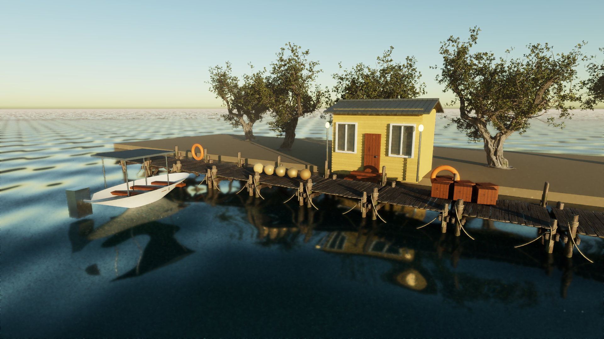

# Rendering validation — 2026-09-07

These results validate the controlled Fury coastal fixture, not a full production
open world or a comparison against GTA 6.

## Target and hardware

- Target: 2560 x 1440, 120 rendered fps (8.33 ms per frame).
- GPU: NVIDIA GeForce RTX 4090, driver 610.74, 24 GiB VRAM.
- Renderer: Direct3D 12, hardware DXR 1.1, path tracing, four maximum bounces.
- Detailed fixture: 8,219,761 instanced triangles; original procedural props plus
  the pinned CC0 pier/tree assets in `assets/render-assets.lock.json`.
- Benchmark: 6,000 frames per case, first 32 and final capture frame excluded;
  one sample per pixel, denoising enabled, vsync disabled, debug layer disabled.
- Camera-flight cases animate the water and a rigid object and orbit the scene.
  The tests ran sequentially, with no concurrent build. Ordinary desktop apps
  remained running. These are render-call and GPU timings, not input-to-display latency.

## 1440p moving-scene results

| Reconstruction | Internal resolution | GPU median | GPU p99 | Complete frame median | Complete frame p95 | Complete frame p99 |
|---|---:|---:|---:|---:|---:|---:|
| Native | 2560 x 1440 | 2.568 ms | 6.884 ms | 3.58 ms | 6.41 ms | 8.18 ms |
| AMD FSR 3.1.5 Quality | 1706 x 960 | 1.445 ms | 4.128 ms | 2.71 ms | 4.45 ms | 5.24 ms |
| Intel XeSS-SR 2.0.2 Quality | 1506 x 848 | 1.729 ms | 4.252 ms | 3.08 ms | 4.57 ms | 5.28 ms |

All three p99 render-call measurements are below 8.33 ms for this fixture. Native
has less headroom; FSR/XeSS Quality are preferable starting points for adding game
simulation and more demanding content. Two-sample experiments cost more, and are
not the certified 120-fps baseline here. No generated frames are counted.

The raw measurements, source fingerprint, executable hash and capture hashes are
in [rtx4090-1440p.json](validation/rtx4090-1440p.json). Do not carry these numbers
forward to a different scene, machine or source revision without re-measuring.

## Correctness gates

[windows-dxr-validation.json](validation/windows-dxr-validation.json) records all
13 GPU cases with the D3D12 debug layer active and zero reported validation errors:

- Native, FSR and XeSS still scenes.
- Each reconstruction mode with camera motion/cut, live resize and vertex deformation.
- Native → FSR → XeSS switching within one process.
- Ray-traced lighting mode.
- Static and moving motion buffers, depth and normal buffers.
- An opaque material becoming alpha-cutout at runtime.

The pixel verifier checks neutral static motion, nonzero moving motion, geometry
variation in depth/normals and actual colored visibility through alpha holes. Build
counters check static BLAS/TLAS reuse and dynamic updates. Separate GPU fixtures
confirmed front-face visibility, mirrored transforms and back-face rejection.

Windows unit tests cover camera inversion/normal transforms, ray/raster jitter
conventions, mip generation, mesh identities, glTF failure semantics and graphics
settings persistence. The playable Vaultline smoke passed OpenGL, explicit software
selection overriding the DX12 environment, DX12 native, FSR and XeSS. A copy without
the FSR runtime correctly failed a request for FSR.

Linux retains OpenGL/software rendering and is exercised by
`scripts/validate-linux.sh`. Hosted CI separately builds Windows, Linux and the
DX12/vendor-SDK configuration. A hosted compilation is not a substitute for GPU
validation on AMD/Intel hardware.

## Current frame

Actual Fury output with the detailed fixture and FSR, not an AI-generated preview:

The fixture still lacks production characters, detailed interiors, terrain dressing,
physically complete water, and the broader content/streaming systems required by
the original visual goal. See [RENDERING.md](RENDERING.md) for the exact limitations.
